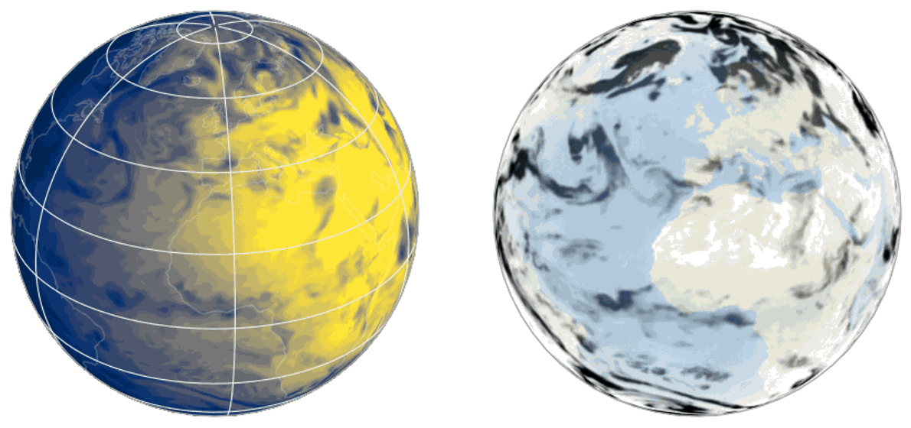
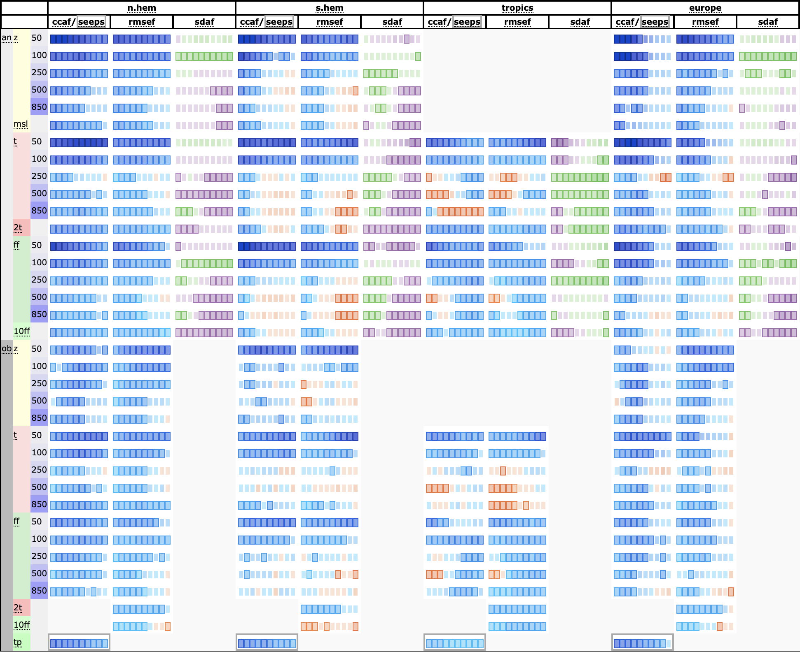
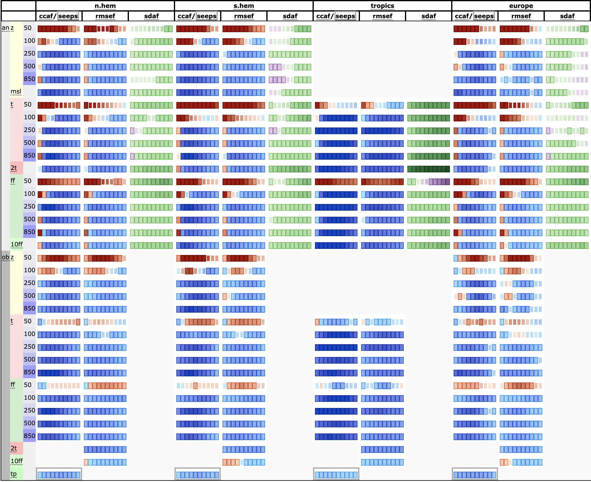

# AIFS-Single-MSE-1.0

## Details

Here, we introduce the **Artificial Intelligence Forecasting System (AIFS)**, a data driven forecast
model developed by the European Centre for Medium-Range Weather Forecasts (ECMWF). 

The operational release of AIFS Single v1.0 marks the first operationally supported AIFS model. Version 1 will
supersede the existing experimental version, [0.2.1 AIFS-single](https://huggingface.co/ecmwf/aifs-single).
The new version, 1.0, will bring changes to the AIFS single model, including among many others:

- Improved performance for upper-level atmospheric variables (AIFS-single still uses 13 pressure-levels, so this improvement mainly refers to 50 hPa)
- Improved scores for total precipitation.
- Additional output variables, including 100 meter winds, snow-fall, solar-radiation and land variables such as soil-moisture and soil-temperature.

<div style="display: flex; justify-content: center;">
  
</div>

To find out more information regarding the specifications and differences, please see the ECMWF Confluence page about the implementation [here](https://confluence.ecmwf.int/display/FCST/Implementation+of+AIFS+Single+v1).

### Description

AIFS is based on a graph neural network (GNN) encoder and decoder, and a sliding window transformer processor,
and is trained on ECMWF’s ERA5 re-analysis and ECMWF’s operational numerical weather prediction (NWP) analyses.

It has a flexible and modular design and supports several levels of parallelism to enable training on
high resolution input data. AIFS forecast skill is assessed by comparing its forecasts to NWP analyses
and direct observational data.

- **Developed by:** ECMWF
- **Model type:** Encoder-processor-decoder model

The full list of input and output fields is shown below:

| Field                                                                                                                                                       | Level type                                                                   | Input/Output |
|-------------------------------------------------------------------------------------------------------------------------------------------------------------|------------------------------------------------------------------------------|--------------|
| Geopotential, horizontal and vertical wind components, specific humidity, temperature                                                                       | Pressure level: 50,100, 150, 200, 250,300, 400, 500, 600,700, 850, 925, 1000 | Both         |
| Surface pressure, mean sea-level pressure, skin temperature, 2 m temperature, 2 m dewpoint temperature, 10 m horizontal wind components, total column water | Surface                                                                      | Both         |
| Soil moisture and soil temperature (layers 1 & 2)                                                                                                           | Surface                                                                      | Both         |
| 100m horizontal wind components, solar radiation (Surface short-wave (solar) radiation downwards and Surface long-wave (thermal) radiation downwards), cloud variables (tcc, hcc, mcc, lcc), runoff and snow fall  | Surface               | Output       |
| Total precipitation, convective precipitation                                                                                                               | Surface                                                                      | Output       |
| Land-sea mask, orography, standard deviation of sub-grid orography, slope of sub-scale orography, insolation, latitude/longitude, time of day/day of year   | Surface                                                                      | Input        |

Input and output states are normalised to unit variance and zero mean for each level. Some of the forcing variables, like orography, are min-max normalised.

#### Model resolution

| | Component | Horizontal Resolution [kms] | Vertical Resolution [levels] |
|---|:---:|:---:|:---:|
| Atmosphere | AIFS-single v1.0 | ~ 36 |  13 |

### Citation

If you use this model in your work, please cite it as follows:

**BibTeX:**

```bibtex
@article{lang2024aifs,
  title={AIFS-ECMWF's data-driven forecasting system},
  author={Lang, Simon and Alexe, Mihai and Chantry, Matthew and Dramsch, Jesper and Pinault, Florian and Raoult, Baudouin and Clare, Mariana CA and Lessig, Christian and Maier-Gerber, Michael and Magnusson, Linus and others},
  journal={arXiv preprint arXiv:2406.01465},
  year={2024}
}
```

**APA:**

```apa
Lang, S., Alexe, M., Chantry, M., Dramsch, J., Pinault, F., Raoult, B., ... & Rabier, F. (2024). AIFS-ECMWF's data-driven forecasting system. arXiv preprint arXiv:2406.01465.
```

### Data Details

Describe the input and output data of your model here, use a table.

| Field                                                                                                                                                       | Level type                                                                   | Input/Output |
|-------------------------------------------------------------------------------------------------------------------------------------------------------------|------------------------------------------------------------------------------|--------------|
| Geopotential, horizontal and vertical wind components, specific humidity, temperature                                                                       | Pressure level: 50,100, 150, 200, 250,300, 400, 500, 600,700, 850, 925, 1000 | Both         |
| Surface pressure, mean sea-level pressure, skin temperature, 2 m temperature, 2 m dewpoint temperature, 10 m horizontal wind components, total column water | Surface                                                                      | Both         |

etc

### License

The model weights, and configuration files are published under a Creative Commons Attribution 4.0 International (CC BY 4.0).
To view a copy of this licence, visit https://creativecommons.org/licenses/by/4.0/

## Training

To train this model you can use the configuration files included in this repository and the following Anemoi packages:

```txt
anemoi-training==0.3.1
anemoi-models==0.4.0
anemoi-graphs>=0.4.4
```

### Training Strategy

Based on the different experiments we have made - the final training recipe for AIFS Single v1.0 has deviated slightly
from the one used for AIFS Single v0.2.1 since we found that we could get a well trained model by skipping the ERA5
rollout and directly doing the rollout on the operational-analysis (extended) dataset. When we say 'extended' we refer 
to the fact that for AIFS Single v0.2.1 we used just operational-analysis data from 2019 to 2021, while in this new 
release we have done the fine-tunning from 2016 to 2022. 

The other important change in the fine-tuning stage is that for AIFS Single v0.2.1 after the 6hr model training the
optimiser was not restarted (ie. rollout was done with the minimal lr of \\(3 × 10^{-7}\\)). For this release we have seen
that restarting the optimiser for the rollout improves the model's performance. For the operational-fine tuning rollout
stage, the learning rate cycle is restarted, gradually decreasing to the minimum value at the end of rollout.

- **Pre-training**: It was performed on ERA5 for the years 1979 to 2022 with a cosine learning rate (LR) schedule and a
total of 260,000 steps. The LR is increased from 0 to \\(10^{-4}\\) during the first 1000 steps, then it is annealed to a
minimum of \\(3 × 10^{-7}\\). The local learning rate used for this stage is \\(3.125 × 10^{-5}\\).

- **Fine-tuning**: The pre-training is then followed by rollout on operational real-time IFS NWP analyses for the years
2016 to 2022, this time with a local learning rate of \\(8 × 10^{−7}\\), which is decreased to \\(3 × 10^{−7}\\). Rollout steps
increase per epoch. In this second stage the warm up period of the optimiser is 100 steps to account for shorter length
of this stage. Optimizer step are equal to 7900 ( 12 epoch with ~630 steps per epoch).

As in the previous version of aifs-single for fine-tuning and initialisation of the model during inference, IFS fields
are interpolated from their native O1280 resolution (approximately \\(0.1°\\)) down to N320 (approximately \\(0.25°\\)).

### Datasets

As `ERA5` is provided open for use through the CDS [Climate Data Store](https://cds.climate.copernicus.eu/), an anemoi dataset can be created from that source.
We include the configs for both the atmospheric and the land under `datasets/`. This is sufficient to replicate the finetuning step done for AIFS Single v1.0.

However, as the model was finetuned on the operational real-time IFS NWP analyses which is not publicly available, we recommend you substitute that dataset for the
`ERA5` one. This will still provide a good dataset to rollout finetune on, but may lead to some drop in skill compared to the AIFS v1.0.

For a point of reference we provide the recipe for the [operational dataset](dataset/aifs-od-an-oper-0001-mars-n320-2016-2023-6h-v6.yaml).

To create these datasets, ensure `anemoi-datasets` is installed, as well as the `cdspai`, then with the following:

```bash
export DATASETS_PATH=??????? # Location where the datasets should be saved

anemoi-datasets create dataset/aifs-ea-an-oper-0001-mars-n320-1979-2022-6h-v6.zarr $DATASETS_PATH/aifs-ea-an-oper-0001-mars-n320-1979-2022-6h-v6.zarr
anemoi-datasets create dataset/aifs-ea-an-oper-0001-mars-n320-1979-2023-6h-v1-land.zarr $DATASETS_PATH/aifs-ea-an-oper-0001-mars-n320-1979-2023-6h-v1-land.zarr
```

When inspected the dataset should look something like below, 

```text
$ anemoi-datasets inspect $DATASETS_PATH/aifs-ea-an-oper-0001-mars-n320-1979-2022-6h-v6.zarr
📦 Path          : aifs-ea-an-oper-0001-mars-n320-1979-2022-6h-v6.zarr
🔢 Format version: 0.30.0

📅 Start      : 1979-01-01 00:00
📅 End        : 2022-12-31 18:00
⏰ Frequency  : 6
🌎 Resolution : N320
🌎 Field shape: None

📐 Shape      : 64,284 × 101 × 1 × 542,080 (12.8 TiB)
💽 Size       : 6.5 TiB (6.5 TiB)
📁 Files      : 64,652

   Index │ Variable       │          Min │         Max │         Mean │       Stdev
   ──────┼────────────────┼──────────────┼─────────────┼──────────────┼────────────
       0 │ q_50           │   2.6865e-08 │ 1.62006e-05 │  2.68021e-06 │ 2.59334e-07
       1 │ q_100          │ -0.000159949 │ 8.04633e-05 │  2.68718e-06 │ 6.13071e-07
       2 │ q_150          │ -0.000212364 │ 0.000360468 │  6.40621e-06 │  4.1424e-06
       3 │ q_200          │ -0.000193205 │  0.00110981 │  2.57954e-05 │ 2.51726e-05
       4 │ q_250          │ -0.000550049 │  0.00258695 │  7.67591e-05 │ 8.38871e-05
       5 │ q_300          │  -0.00046527 │  0.00566677 │  0.000167532 │ 0.000190492
       6 │ q_400          │ -0.000551976 │  0.00914807 │  0.000497929 │ 0.000576619
       7 │ q_500          │ -0.000152837 │   0.0143142 │   0.00109657 │  0.00122096
       8 │ q_600          │        1e-08 │   0.0210872 │   0.00198313 │  0.00196408
       9 │ q_700          │  5.37426e-09 │   0.0228418 │   0.00314357 │  0.00276659
      10 │ q_850          │  5.37426e-09 │   0.0278792 │   0.00598156 │   0.0042142
      11 │ q_925          │  5.37426e-09 │   0.0350411 │   0.00794087 │  0.00500381
      12 │ q_1000         │  2.88243e-09 │   0.0494703 │   0.00928783 │  0.00579566
      13 │ t_50           │      167.867 │      260.89 │      211.487 │     7.56812
      14 │ t_100          │      172.154 │     248.854 │      205.002 │     11.4788
      15 │ t_150          │      178.173 │     244.696 │      211.584 │     7.49888
      16 │ t_200          │      183.784 │     245.433 │       218.55 │      5.3767
      17 │ t_250          │      191.239 │     249.509 │      225.568 │     7.34267
      18 │ t_300          │       197.78 │     260.994 │      233.195 │     9.43169
      19 │ t_400          │      208.742 │     273.609 │      247.382 │       10.95
      20 │ t_500          │      212.221 │     285.832 │      258.355 │     11.0172
      21 │ t_600          │      195.089 │     296.385 │      266.697 │     11.0015
      22 │ t_700          │      200.998 │     305.448 │      273.519 │      11.591
      23 │ t_850          │      212.508 │     315.461 │      280.978 │     12.4361
      24 │ t_925          │      213.554 │      321.55 │      283.987 │     12.8566
      25 │ t_1000         │      209.922 │     326.239 │      288.181 │     13.5001
      26 │ u_50           │     -75.4288 │     99.5174 │      3.50734 │     14.9634
      27 │ u_100          │     -67.6927 │     86.0725 │      10.1976 │     14.1999
      28 │ u_150          │     -61.2444 │     113.317 │      14.8383 │     17.2511
      29 │ u_200          │      -73.406 │     123.846 │      15.7439 │     18.7818
      30 │ u_250          │     -82.1878 │     127.143 │      14.5885 │     18.6276
      31 │ u_300          │     -86.7315 │     122.622 │      12.7216 │     17.3917
      32 │ u_400          │     -77.9424 │     108.466 │      9.26678 │     14.4208
      33 │ u_500          │     -62.4702 │      90.366 │        6.727 │      12.074
      34 │ u_600          │     -65.6111 │     78.8971 │      4.82629 │     10.4101
      35 │ u_700          │     -75.9872 │     66.6406 │      3.26236 │     9.22929
      36 │ u_850          │     -80.9958 │     66.6414 │      1.12268 │     8.21662
      37 │ u_925          │     -68.8523 │     65.2574 │     0.243613 │     7.94413
      38 │ u_1000         │     -45.4909 │      58.753 │     -0.36609 │      6.1566
      39 │ v_50           │     -81.6853 │     82.4321 │  0.000255893 │     5.72976
      40 │ v_100          │     -67.8286 │      62.051 │    0.0151214 │     7.12387
      41 │ v_150          │     -85.9455 │     74.2282 │   -0.0598759 │     9.78919
      42 │ v_200          │     -103.345 │     95.8682 │   -0.0707533 │     12.1278
      43 │ v_250          │      -99.923 │     108.368 │   -0.0433348 │     13.1788
      44 │ v_300          │     -97.7499 │     103.697 │   -0.0252061 │     12.7475
      45 │ v_400          │      -89.486 │     92.6908 │   -0.0185685 │     10.5127
      46 │ v_500          │     -74.8812 │     80.1516 │   -0.0326365 │     8.56892
      47 │ v_600          │     -68.4702 │     71.5868 │   -0.0452628 │     7.27982
      48 │ v_700          │     -67.5485 │     71.3261 │   -0.0137349 │     6.42202
      49 │ v_850          │     -67.2378 │     75.3445 │    0.0877886 │     5.89422
      50 │ v_925          │     -65.8665 │     163.842 │     0.177548 │     6.19476
      51 │ v_1000         │     -64.0494 │     163.828 │     0.178525 │     5.14791
      52 │ w_50           │     -2.21568 │     2.24961 │  6.70199e-07 │   0.0125452
      53 │ w_100          │     -10.7408 │     3.33515 │  2.15024e-06 │   0.0280086
      54 │ w_150          │     -20.1212 │     4.84989 │  1.25924e-05 │   0.0606806
      55 │ w_200          │     -26.8108 │      6.6925 │  3.94195e-05 │   0.0975885
      56 │ w_250          │     -31.4228 │     11.4803 │  7.02464e-05 │    0.132003
      57 │ w_300          │     -34.8451 │     17.0263 │  8.52204e-05 │    0.164658
      58 │ w_400          │     -39.4861 │     18.4086 │  8.90885e-05 │     0.21381
      59 │ w_500          │      -37.245 │     18.8681 │  8.80957e-05 │    0.235877
      60 │ w_600          │     -33.1998 │     17.6892 │  0.000253372 │    0.247132
      61 │ w_700          │     -29.9697 │     20.6734 │   0.00102935 │    0.256241
      62 │ w_850          │     -19.5776 │     20.5055 │   0.00487682 │    0.246758
      63 │ w_925          │     -21.7133 │     40.5773 │    0.0078363 │    0.201285
      64 │ w_1000         │     -35.2052 │     68.0232 │   0.00928818 │     0.12124
      65 │ z_50           │       175443 │      208851 │       200917 │     3932.14
      66 │ z_100          │       138013 │      167040 │       159672 │     4166.84
      67 │ z_150          │       115286 │      142918 │       135491 │     4761.52
      68 │ z_200          │      98691.9 │      124578 │       117737 │     4876.26
      69 │ z_250          │      85458.6 │      109549 │       103526 │     4645.35
      70 │ z_300          │      74454.4 │     96907.9 │      91527.2 │     4254.57
      71 │ z_400          │      56698.5 │     76166.1 │      71688.1 │     3439.99
      72 │ z_500          │      42391.4 │     59318.2 │        55479 │     2763.77
      73 │ z_600          │      30192.8 │       45087 │      41723.5 │     2218.66
      74 │ z_700          │      19449.1 │     32773.1 │      29749.3 │     1763.95
      75 │ z_850          │      5268.75 │     17814.1 │      14238.5 │     1220.63
      76 │ z_925          │     -1177.09 │     11246.9 │      7353.98 │     1030.06
      77 │ z_1000         │     -7330.12 │     5297.91 │      932.325 │     911.842
      78 │ 10u            │      -46.176 │     60.1726 │    -0.342538 │     5.51585
      79 │ 10v            │     -74.5393 │     163.283 │      0.17551 │     4.58286
      80 │ 2d             │      186.141 │      307.43 │      282.213 │     15.2648
      81 │ 2t             │      189.474 │     326.493 │      287.204 │      15.547
      82 │ lsm            │            0 │           1 │     0.287023 │    0.443962
      83 │ msl            │      91087.1 │      107751 │       101136 │      1131.1
      84 │ sdor           │            0 │     1112.79 │      21.1038 │     64.3942
      85 │ skt            │      187.794 │      347.32 │      287.964 │     16.4256
      86 │ slor           │       0.0001 │    0.189624 │   0.00351223 │   0.0105187
      87 │ sp             │        47118 │      108583 │      98527.6 │     6840.73
      88 │ tcw            │    0.0259996 │     176.013 │      24.1576 │     16.8269
      89 │ z              │     -1860.91 │     57860.1 │      2296.05 │     6221.34
      90 │ cp             │            0 │     0.12397 │  0.000392135 │  0.00130127
      91 │ tp             │            0 │    0.556885 │  0.000723922 │  0.00236946
      92 │ cos_latitude   │    0.0037546 │    0.999997 │      0.78162 │    0.225291
      93 │ cos_longitude  │           -1 │           1 │ -3.63117e-09 │    0.707107
      94 │ sin_latitude   │    -0.999993 │    0.999993 │  1.68892e-08 │    0.581648
      95 │ sin_longitude  │           -1 │           1 │ -3.04357e-10 │    0.707107
      96 │ cos_julian_day │    -0.999998 │           1 │  3.26027e-05 │    0.707118
      97 │ cos_local_time │           -1 │           1 │            0 │    0.707107
      98 │ sin_julian_day │    -0.999999 │    0.999999 │  4.48532e-06 │    0.707095
      99 │ sin_local_time │           -1 │           1 │            0 │    0.707107
     100 │ insolation     │            0 │           1 │      0.24912 │    0.321957
   ──────┴────────────────┴──────────────┴─────────────┴──────────────┴────────────
```

#### Pretraining step

After creating the data, set the following environments variables and use the pretraining configuration file.

```bash
export DATASETS_PATH=??????? # Location where the datasets were saved
export OUTPUT_PATH=???????   # Where checkpoints, logs, metric and graphs should be stored

cd training/pretraining
anemoi-training train --config-name=pretraining.yaml
```

#### Finetuning Step

Once pretraining is done, set the run id and use the finetuning configuration file.

```bash
export DATASETS_PATH=??????? # Location where the datasets were saved
export OUTPUT_PATH=???????   # Where checkpoints, logs, metric and graphs should be stored

export PRETRAINING_RUN_ID=??????? # ID of the pretraining run.

cd training/finetuning
anemoi-training train --config-name=finetuning.yaml
```

This finetuning steps assumes an uninterrupted 13 epochs. If an error occurs, and training is restarted ensure you update
the `PRETRAINING_RUN_ID` to the new finetuning id. Additonally, the start of the `rollout` will need to be manually 
updated to ensure correct rollout finetuning.

#### Training Hyperparameters

- **Optimizer:** We use *AdamW* (Loshchilov and Hutter [2019]) with the \\(β\\)-coefficients set to 0.9 and 0.95.

- **Loss function:** The loss function is an area-weighted mean squared error (MSE) between the target atmospheric state
and prediction.

- **Loss scaling:** A loss scaling is applied for each output variable. The scaling was chosen empirically such that
all prognostic variables have roughly equal contributions to the loss, with the exception of the vertical velocities,
for which the weight was reduced. The loss weights also decrease linearly with height, which means that levels in 
the upper atmosphere (e.g., 50 hPa) contribute relatively little to the total loss value.

## Evaluation

AIFS is evaluated against ECMWF IFS (Integrated Forecast System) for 2022. The results of such evaluation are summarized in 
the scorecard below that compares different forecast skill measures across a range of
variables. For verification, each system is compared against the operational ECMWF analysis from which the forecasts
are initialised. In addition, the forecasts are compared against radiosonde observations of geopotential, temperature
and windspeed, and SYNOP observations of 2 m temperature, 10 m wind and 24 h total precipitation. The definition
of the metrics, such as ACC (ccaf), RMSE (rmsef) and forecast activity (standard deviation of forecast anomaly,
sdaf) can be found in e.g Ben Bouallegue et al. ` [2024].

### AIFS Single v1.0 vs AIFS Single v0.2.1 (2023)

<div style="display: flex; justify-content: center;">
  
</div>

### AIFS Single v1.0 vs IFS (2024)

<div style="display: flex; justify-content: center;">
  
</div>

Forecasts are initialised on 00 and 12 UTC. The scorecard show relative score changes as function of lead time (day 1 to 10) for northern extra-tropics (n.hem),
southern extra-tropics (s.hem), tropics and Europe. Blue colours mark score improvements and red colours score
degradations. Purple colours indicate an increased in standard deviation of forecast anomaly, while green colours
indicate a reduction. Framed rectangles indicate 95% significance level. Variables are geopotential (z), temperature
(t), wind speed (ff), mean sea level pressure (msl), 2 m temperature (2t), 10 m wind speed (10ff) and 24 hr total
precipitation (tp). Numbers behind variable abbreviations indicate variables on pressure levels (e.g., 500 hPa), and
suffix indicates verification against IFS NWP analyses (an) or radiosonde and SYNOP observations (ob). Scores
shown are anomaly correlation (ccaf), SEEPS (seeps, for precipitation), RMSE (rmsef) and standard deviation of
forecast anomaly (sdaf, see text for more explanation).

Additional evaluation analysis including tropycal cyclone performance or comparison against other popular data-driven models can be found in AIFS preprint (https://arxiv.org/pdf/2406.01465v1) section 4.