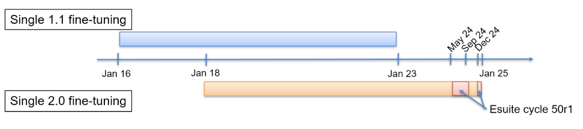

# AIFS Single v2


[](https://creativecommons.org/licenses/by/4.0/)
[](https://anemoi.readthedocs.io/)
[]()
[]()

The AIFS is ECMWF's **Artificial Intelligence Forecasting System**.
It consists of two data-driven medium-range forecast models:
- AIFS Single v2 (described here)
- AIFS ENS v2 (described on the [following page](https://huggingface.co/ecmwf/aifs-ens-2.0))

**AIFS Single v2** was implemented on **12 May 2026** and supersedes version [1.1](https://huggingface.co/ecmwf/aifs-single-1.1).
It is run operationally by ECMWF, generating a single 15-day (6-hourly) global forecast four times per day.

## Table of contents

- [What's new in v2](#whats-new-in-v2)
- [Quickstart](#quickstart)
- [Model overview](#model-overview)
- [Data details](#data-details)
- [Training details](#training-details)
- [Evaluation](#evaluation)
- [Known limitations](#known-limitations)
- [Technical specifications](#technical-specifications)
- [Citation](#citation)

---

## What's new in v2
The release of AIFS v2 introduces:
- A new wave component, including 11 wave variables, marking **ECMWF's first operational data-driven wave forecasts**.
- The addition of a new snow variable to the existing land component.
- Improved vertical velocities, by changing parameter W from a prognostic to a diagnostic field.
- An improved representation of the stratosphere, with the addition of pressure level fields at 10hPa.
- An improved training regime, using 2 years of additional training data compared to AIFS Single [v1.1](https://huggingface.co/ecmwf/aifs-single-1.1).

For full details of the changes introduced with this upgrade, see the [implementation page](https://confluence.ecmwf.int/display/FCST/Implementation+of+AIFS+Single+v2).

---

## Quickstart
### Access AIFS Single v2 model data
ECMWF generates operational forecasts from AIFS Single v2 four times per day (at 00, 06, 12 & 18 UTC).
Users can access the forecast data free-of-charge through various [open data platforms](https://www.ecmwf.int/en/forecasts/datasets/open-data).

---

## Model overview

### Model description

<!-- Provide a longer summary of what this model is. -->

AIFS Single v2 is based on a graph neural network (GNN) encoder and decoder, and a sliding window transformer processor.

<div style="display: flex; justify-content: center;">
  
  
</div>

The model has a flexible and modular design and supports several levels of parallelism to enable training on
high resolution input data. AIFS forecast skill is assessed by comparing its forecasts to numerical weather prediciton (NWP) analyses
and direct observational data.

- **Developed by:** ECMWF
- **Model type:** Encoder-processor-decoder model
- **License:** Inference model weights are published under a Creative Commons Attribution 4.0 International (CC BY 4.0).
To view a copy of this licence, visit https://creativecommons.org/licenses/by/4.0/.

### Model resolution
AIFS Single v2 introduces a **new pressure level** to the stratospheric component.
| Model | Vertical resolution [pressure levels] (hPa) |
|:---|:---|
| AIFS-single v2.0 | 10 (new), 50, 100, 150, 200, 250, 300, 400, 500, 600, 700, 850, 925, 1000 |

There are no changes in horiztonal resolution compared to previous version AIFS Single v1.1.
| Component | Horizontal Resolution [kms] | Vertical Resolution [levels] |
|---|:---:|:---:|
| Atmosphere | ~ 31 |  14 |

### Model Sources

<!-- Provide the basic links for the model. -->

- **Repository:** [Anemoi](https://anemoi.readthedocs.io/en/latest/) is an open-source framework for
  creating data-driven weather forecasting systems. Anemoi is co-developed by ECMWF and national meteorological
  services across Europe.
- **Papers:**
  - [AIFS: ECMWF's data-driven forecasting system (2024)](https://arxiv.org/abs/2406.01465)
  - [An update to ECMWF's machine-learned weather forecast model AIFS (2025)](https://arxiv.org/abs/2509.18994)
  - [Representing the Surface Ocean in ECMWF's data-driven forecasting system AIFS (2026)](https://arxiv.org/abs/2604.25559)
---

## Data details

### Training data
The data used for **pre-training** AIFS Single v2 remains the same as for the previous model version ([v1.1](https://huggingface.co/ecmwf/aifs-single-1.1)):
- Pre-training was performed on ERA5 data covering the years 1979–2022 over 260,000 training steps.

The data used for **fine-tuning** AIFS Single v2 has been updated:
- Fine-tuning was performed on 2 years of additional data compared to [AIFS Single v1.1](https://huggingface.co/ecmwf/aifs-single-1.1).
- In particular, fine-tuning was performed on ECMWF operational analysis data and
  IFS 50r1 esuite analysis data, covering the years 2018-2024 over 7,900 training steps.
<div style="display: flex; justify-content: center;">
  
</div>

*Note: The IFS 50r1 esuite analysis data used for fine-tuning is not available to users. It consists of prototype data from early versions of IFS Cycle 50r1.*

As in previous versions of AIFS Single, IFS fields are interpolated from their native O1280 resolution
(approximately 0.1°) using MARS default interpolation tools down to N320 (approximately 0.25°) for
fine-tuning and initialisation of the model during inference.

### Data parameters

#### New parameters

AIFS Single v2 introduces 12 new parameters, which were used for model training and are output by the
model during a forecast.

| Short Name | Name | Units |
|:----------:|:----:|:-----:|
| h1012 | Significant wave height of all waves with periods within the inclusive range from 10 to 12 seconds | \(m\) |
| h1214 | Significant wave height of all waves with periods within the inclusive range from 12 to 14 seconds | \(m\) |
| h1417 | Significant wave height of all waves with periods within the inclusive range from 14 to 17 seconds | \(m\) |
| h1721 | Significant wave height of all waves with periods within the inclusive range from 17 to 21 seconds | \(m\) |
| h2125 | Significant wave height of all waves with periods within the inclusive range from 21 to 25 seconds | \(m\) |
| h2530 | Significant wave height of all waves with periods within the inclusive range from 25 to 30 seconds | \(m\) |
| wmb | Model bathymetry | \(m\) |
| swh | Significant wave height | \(m\) |
| mwd | Mean wave direction | \(Degree true\) |
| mwp | Mean wave period | \(s\) |
| cdww | Coefficient of drag with waves | \(dimensionless\) |
| fscov | Fraction of snow cover | \(Proportion\) |

---

## Training Details

### Training Data

<!-- This should link to a Dataset Card, perhaps with a short stub of information on what the training data is all about as well as documentation related to data pre-processing or additional filtering. -->
AIFS Single v2 is trained on ECMWF’s ERA5 re-analysis and ECMWF’s operational numerical weather prediction (NWP) analyses as
described in the [training data](#training-data) section.

AIFS Single v2 is trained to produce 6-hour forecasts. It receives as input a representation of the atmospheric states
at \\(t_{−6h}\\), \\(t_{0}\\), and then forecasts the state at time \\(t_{+6h}\\).

<div style="display: flex; justify-content: center;">
  
</div>

The table below shows all parameters used and output by AIFS Single v2. New parameters and levels are marked **bold**.

| Field | Level type | Input/Output |
|---|---|---|
| Geopotential (Z), horizontal and vertical wind components (U, V), temperature (T) | Pressure levels: **10**, 50, 100, 150, 200, 250, 300, 400, 500, 600, 700, 850, 925, 1000 | Both ("Prognostic") |
| Specific humidity (Q) | Pressure levels: 100, 150, 200, 250, 300, 400, 500, 600, 700, 850, 925, 1000 | Both ("Prognostic") |
| Vertical velocity (W) | Pressure levels: **10**, 50, 100, 150, 200, 250, 300, 400, 500, 600, 700, 850, 925, 1000 | Output ("Diagnostic") |
| Specific humidity (Q) | Pressure level: 50 | Output ("Diagnostic") |
| Surface pressure (SP), mean sea-level pressure (MSL), sea-surface temperature (SST), skin temperature (SKT), 2m temperature (2T), 2m dewpoint temperature (2D), 10m horizontal wind components (10U, 10V), total column water (TCW), **mean wave period (MWP)**, **mean wave direction (MWD)**, **coefficient of drag with waves (CDWW)**, **significant wave height (SWH)**, significant wave height of all waves with periods within the inclusive range from: <br><br> - **10 to 12 seconds (H1012)** <br> - **12 to 14 seconds (H1214)** <br> - **14 to 17 seconds (H1417)** <br> - **17 to 21 seconds (H1721)** <br> - **21 to 25 seconds (H2125)** <br> - **25 to 30 seconds (H2530)** | Surface | Both ("Prognostic") |
| Volumetric soil moisture (VSW) and soil temperature (SOT), both at soil depth 1 and 2 | Soil layer | Both ("Prognostic") |
| 100m horizontal wind components (100U, 100V), surface short-wave (solar) radiation downwards (SSRD), surface long-wave (thermal) radiation downwards (STRD), cloud variables (TCC, HCC, MCC, LCC), runoff water equivalent (ROWE) and snow fall (SF), total precipitation (TP), convective precipitation (CP), **fraction of snow cover (FSCOV)** | Surface | Output ("Diagnostic") |
| Standard deviation of sub-gridscale orography (SDOR), slope of sub-gridscale orography (SLOR), land-sea mask (LSM), Geopotential (Z), insolation, latitude/longitude, time of day/day of year | Surface | Input ("Forcings") |

### Training Procedure

This upgrade does not introduce any changes to the model architecture; the model remains the same as the existing operational model
[v1.1](https://huggingface.co/ecmwf/aifs-single-1.1). Technical details about the model architecture are detailed in the arXiv
preprints [here](https://arxiv.org/abs/2509.18994) and [here](https://arxiv.org/abs/2406.01465).

#### Speeds, Sizes, Times

<!-- This section provides information about throughput, start/end time, checkpoint size if relevant, etc. -->

Data parallelism is used for training, with a batch size of 16. One model instance is split across one 120GB GH200
GPUs. Training is done using mixed precision (Micikevicius et al. [2018]), and the entire process
takes about 4 days, with 16 GPUs in total. The checkpoint size is 994MB and as mentioned above, it does not include the optimizer
state.

---

## Evaluation

<!-- This section describes the evaluation protocols and provides the results. -->
Interactive scorecards presenting the performance of AIFS Single v2 between January-March 2026 are now available.
The scorecards compare performance when initialised from 49r1 and 50r1 IFS initial conditions: 

- [AIFS Single v2 (initialised from 50r1) compared with AIFS Single v1.1](initialised from 49r1)(https://sites.ecmwf.int/aifs/scorecards/AIFS-Single-v2%20vs%20AIFS-Single-v1.1.html)
- [AIFS Single v2 compared with AIFS Single v1.1 (both initialised from 50r1)](https://sites.ecmwf.int/aifs/scorecards/AIFS-Single-v2%20vs%20AIFS-Single-v1.1%20from%2050r1.html)

---

## Known limitations

Please refer to https://confluence.ecmwf.int/display/FCST/Known+AIFS+Forecasting+Issues.

---

## Technical specifications

### Hardware

<!--  {{ hardware_requirements | default("[More Information Needed]", true)}} -->

AIFS Single v2 was trained on 16 GH200 GPUs (120GB).

### Software

The model was developed and trained using the [Anemoi framework](https://anemoi.readthedocs.io/en/latest/).
The Anemoi framework provides a complete toolkit to develop data-driven weather models –
from data preparation through to inference. The development is primarily driven by a number
of European Meterological Organisations but open to contributions from any organisation or any individual.
The framework is composed of several packages which target the different components necessary to
construct data-driven weather models. To aid development and deployment, each package collects metadata
that can be used by the subsequent packages. The framework builds upon on established Python tools
including PyTorch, Lighting, Hydra, Zarr, Xarray and earthkit.

---

## Citation

<!-- If there is a paper or blog post introducing the model, the APA and Bibtex information for that should go in this section. -->

If you use this model in your work, please cite it as follows:

**BibTeX:**

```bibtex
@article{lang2024aifs,
  title={AIFS-ECMWF's data-driven forecasting system},
  author={Lang, Simon and Alexe, Mihai and Chantry, Matthew and Dramsch, Jesper and Pinault, Florian and Raoult, Baudouin and Clare, Mariana CA and Lessig, Christian and Maier-Gerber, Michael and Magnusson, Linus and others},
  journal={arXiv preprint arXiv:2406.01465},
  year={2024}
}
```

**APA:**

```apa
Lang, S., Alexe, M., Chantry, M., Dramsch, J., Pinault, F., Raoult, B., ... & Rabier, F. (2024). AIFS-ECMWF's data-driven forecasting system. arXiv preprint arXiv:2406.01465.

```

---

## More information
All papers:
  - [AIFS: ECMWF's data-driven forecasting system (2024)](https://arxiv.org/abs/2406.01465)
  - [An update to ECMWF's machine-learned weather forecast model AIFS (2025)](https://arxiv.org/abs/2509.18994)
  - [Representing the Surface Ocean in ECMWF's data-driven forecasting system AIFS (2026)](https://arxiv.org/abs/2604.25559)

Blog posts:
- [Integrating snow fields into AIFS v2 (2026)](https://www.ecmwf.int/en/newsletter/186/news/integrating-snow-fields-aifs-v2)
- [Let it snow! How machine learning will forecast snow in the AIFS (2025)](https://www.ecmwf.int/en/about/media-centre/aifs-blog/2025/let-it-snow-machine-learning-snow-forecast)
- [Representing ocean wind waves in ECMWF's AIFS (2025)](https://www.ecmwf.int/en/about/media-centre/aifs-blog/2025/representing-ocean-wind-waves-ecmwfs-aifs)
